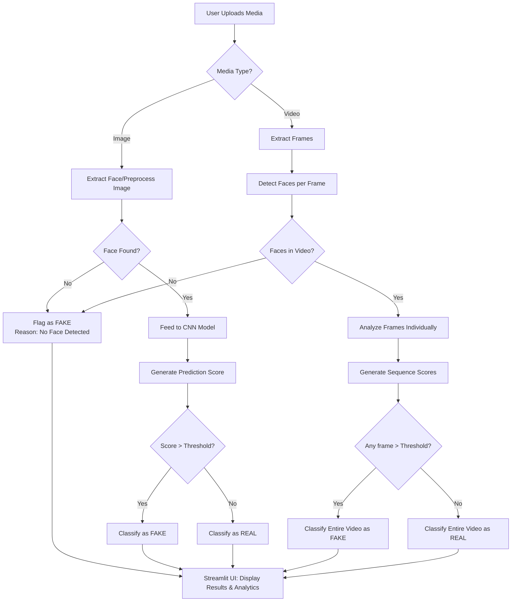

# DeepFake Video and Image Detection

A deep learning-based project to detect deepfake images and videos using TensorFlow, Keras, and OpenCV. This application provides a comprehensive pipeline from media upload to detailed visual analysis, flagging manipulated content with high precision.

## 🌟 Features

- **Image Detection**: Detect deepfake images using a pre-trained Convolutional Neural Network (CNN).
- **Video Detection**: Analyze videos frame-by-frame utilizing an advanced Xception + LSTM sequence model.
- **Conservative Video Logic**: Any single frame detected as "fake" instantly flags the entire video as manipulated.
- **Face Detection Validation**: Employs OpenCV-based face detection to ensure analysis only occurs on valid faces (reduces false positives).
- **Batch Processing**: Analyze multiple images concurrently.
- **Interactive Web Interface**: Streamlit-powered frontend offering real-time feedback, detailed metrics, and frame-by-frame timeline analysis using Plotly.

---

## 🛠️ Technology Stack

This project leverages modern Python libraries for machine learning, image processing, and web development:

- **Frontend & UI**: [Streamlit](https://streamlit.io/) (for building the interactive web application).
- **Machine Learning**: 
  - [TensorFlow](https://www.tensorflow.org/) & **Keras** (core model architecture, loading, and inference).
  - [Scikit-Learn](https://scikit-learn.org/) (analytical metrics).
- **Computer Vision & Processing**: 
  - [OpenCV](https://opencv.org/) (`opencv-python-headless` for face detection, frame extraction, and pixel-level analysis).
  - [Pillow (PIL)](https://python-pillow.org/) (for robust image loading and manipulation).
- **Data Manipulation & Visualization**:
  - [NumPy](https://numpy.org/) (array operations and numerical computation).
  - [Plotly](https://plotly.com/) (interactive data visualization for frame score distributions).
- **Language**: Python 3.x

---

## ⚙️ System Architecture

The following flowchart illustrates the high-level request lifecycle for DeepFake Detection:



---

## 🚀 Installation

1. **Clone the repository:**
   ```bash
   git clone <repository_url>
   cd deepfake-detection
   ```

2. **Create a virtual environment (recommended):**
   ```bash
   python -m venv venv
   # On Windows:
   venv\Scripts\activate
   # On macOS/Linux:
   source venv/bin/activate
   ```

3. **Install required dependencies:**
   ```bash
   pip install -r requirements.txt
   ```

---

## 💻 Usage

### Running the Web Application

To launch the Streamlit interface, run the following command from the root directory:

```bash
streamlit run app.py
```
After executing, open your browser and navigate to `http://localhost:8501`.

### Testing Face Detection Independently

If you want to validate the OpenCV cascade face extractor independently:

```bash
python test_face_extraction.py
```

---

## 📂 Project Structure

```text
deepfake_detection/
├── README.md                  # Project documentation
├── requirements.txt           # Python dependencies
├── app.py                     # Streamlit web application entry point
├── deepfake_image_model.h5    # Pre-trained image detection model (CNN)
├── deepfake_video_model.h5    # Pre-trained video detection model (Xception+LSTM)
├── test_face_extraction.py    # Validation tests for Haar cascades
├── model/
│   ├── __init__.py
│   └── deepfake_model.py      # Model architecture definitions
└── utils/
    ├── __init__.py
    ├── detection.py           # Core detection engine & prediction logic
    └── preprocessing.py       # Image/video frame extraction and resizing
```

---

## 🧠 Model Architecture details

The project natively supports two deep learning architectures depending on the media input:

### 1. Image Model (CNN)
- **Architecture**: Sequential Convolutional Neural Network.
- **Layers**: Multiple Conv2D layers for feature extraction, interspersed with MaxPooling2D layers for spatial reduction, and Dropout layers to mitigate overfitting.
- **Output**: A single node with a Sigmoid activation function for binary classification (Real vs. Fake).

### 2. Video Model (LSTM + Xception)
- **Feature Extraction Backbone**: Pre-trained **Xception** network wrapped in a `TimeDistributed` layer to process frames independently.
- **Temporal Modeling**: **LSTM** (Long Short-Term Memory) layers process the sequence of spatial features extracted from frames to detect temporal anomalies (e.g., flickering or unnatural movements).
- **Output**: Dense layers resulting in binary probability outputs.

---

## 🤝 Contributing
Contributions are welcome! Feel free to fork this project, submit pull requests, or open an issue if you encounter bugs or want to request a new feature.

## 📄 License
This project is licensed under the MIT License.
